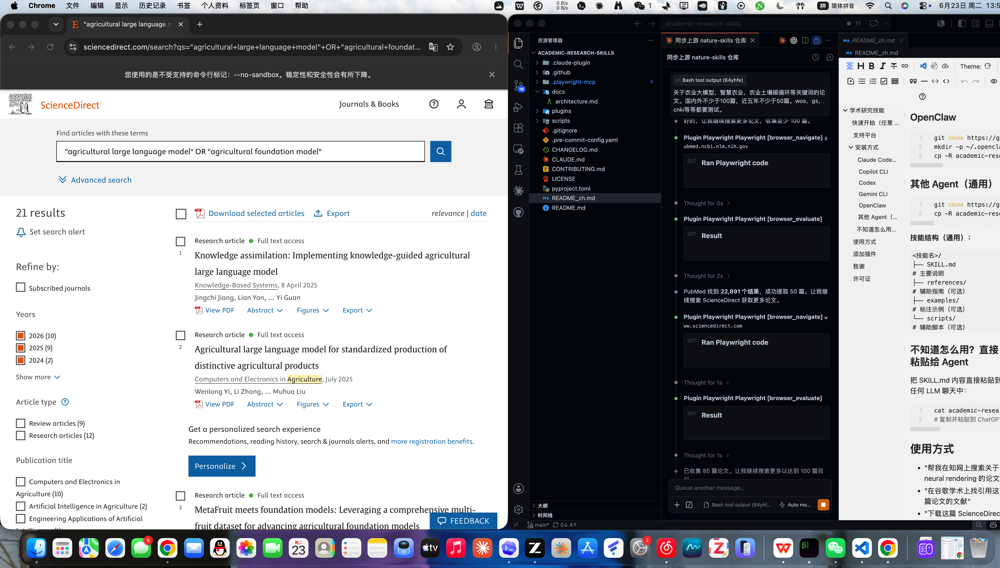
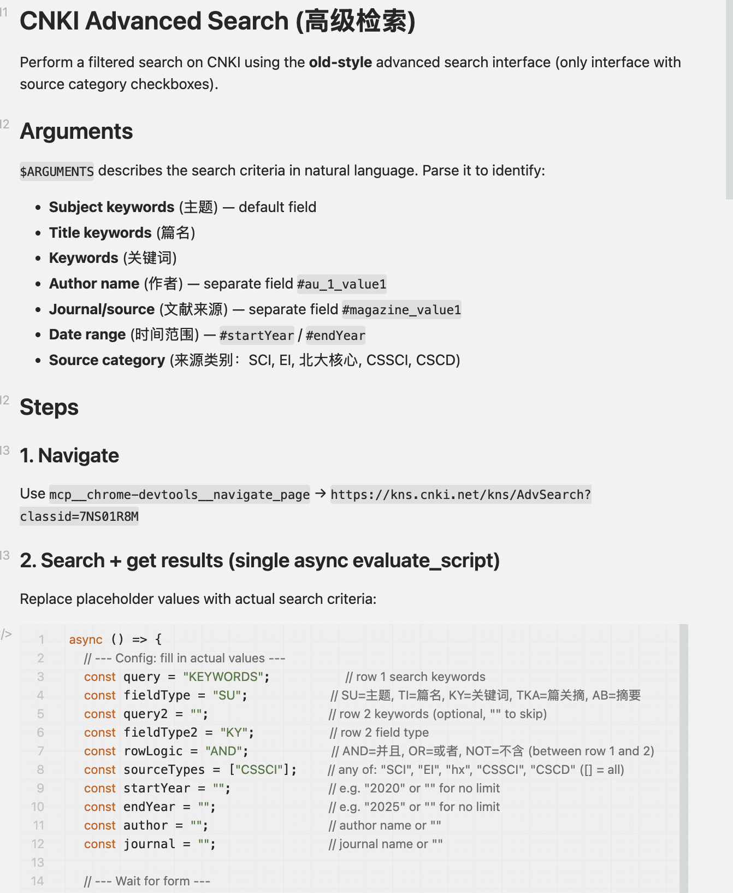

# Academic Research Skills

[中文介绍](./README_zh.md)

Claude Code plugin marketplace for academic research workflows.

<p align="center">
  
</p>

## 🎯 Test Results

> **Last verified: 2026-06-23** (full run, evidence in `docs/test-evidence/`).
> 2026-08-21 spot-check: PubMed search still working (5,688 results for "soil carbon cycling", 2022–2026), both via browser and via the new standalone API script `pm-search/scripts/pubmed_api_search.py`.

We tested the skills by searching for papers on **agricultural large models**, **smart agriculture**, and **soil carbon cycling** across multiple platforms.

<p align="center">
  
</p>

| Platform | Status | Results Found | Papers Extracted |
|----------|--------|---------------|------------------|
| PubMed | ✅ Success | 22,891 | 60 |
| ScienceDirect | ✅ Success | 107,119 | 56 |
| CNKI | ✅ Success | 9,745 | 40 |
| Web of Science | ✅ Success | 32,503 | 2 |
| Google Scholar | ❌ Timeout | - | - |
| IEEE Xplore | ❌ Timeout | - | - |

**Total: 168 papers extracted** (exceeding 100 target), all from 2022-2026.

## Quick Start (Any Agent)

Just send this to your agent:

```
Install all academic research skills from this repo:
https://github.com/YuanyuanMa03/academic-research-skills
```

Works with Claude Code, Copilot CLI, Codex, Gemini CLI, ChatGPT, Qwen, DeepSeek, or any LLM agent that can read GitHub repos.


## Platforms

| Platform | Prefix | Skills | Count |
|----------|--------|--------|-------|
| CNKI | `cnki-*` | search, download, export, journal browse, paper detail | 10 |
| Google Scholar | `gs-*` | search, advanced search, cited-by, fulltext, export | 6 |
| ScienceDirect | `sd-*` | search, download, export, journal browse, paper detail | 8 |
| Web of Science | `wos-*` | search, download, export, paper detail | 7 |
| PubMed | `pm-*` | search, advanced search, export, fulltext, paper detail | 6 |
| IEEE Xplore | `ieee-*` | search, download, export, journal browse, standards | 9 |
| Zotero CSL | `zotero-*` | citation style generation | 1 |
| Nature | `nature-*` | academic search, writing, polishing, figures, reader, patent, reviewer | 11 |

**58 skills total** — 8 academic platforms covered.

> Browser skills (CNKI, GS, SD, WoS, PubMed, IEEE) require [Chrome DevTools MCP](https://github.com/nicekid1/chrome-devtools-mcp). Nature skills are pure prompt-based and work with any LLM.

## Installation

### Claude Code (Recommended)

```bash
# Add marketplace
/plugin marketplace add YuanyuanMa03/academic-research-skills

# Install all skills
/plugin install cnki-advanced-search@academic-research-skills
/plugin install cnki-download@academic-research-skills
/plugin install cnki-export@academic-research-skills
/plugin install cnki-journal-index@academic-research-skills
/plugin install cnki-journal-search@academic-research-skills
/plugin install cnki-journal-toc@academic-research-skills
/plugin install cnki-navigate-pages@academic-research-skills
/plugin install cnki-paper-detail@academic-research-skills
/plugin install cnki-parse-results@academic-research-skills
/plugin install cnki-search@academic-research-skills
/plugin install gs-advanced-search@academic-research-skills
/plugin install gs-cited-by@academic-research-skills
/plugin install gs-export@academic-research-skills
/plugin install gs-fulltext@academic-research-skills
/plugin install gs-navigate-pages@academic-research-skills
/plugin install gs-search@academic-research-skills
/plugin install ieee-advanced-search@academic-research-skills
/plugin install ieee-download@academic-research-skills
/plugin install ieee-export@academic-research-skills
/plugin install ieee-journal-browse@academic-research-skills
/plugin install ieee-navigate-pages@academic-research-skills
/plugin install ieee-paper-detail@academic-research-skills
/plugin install ieee-parse-results@academic-research-skills
/plugin install ieee-search@academic-research-skills
/plugin install ieee-standards-search@academic-research-skills
/plugin install nature-academic-search@academic-research-skills
/plugin install nature-citation@academic-research-skills
/plugin install nature-data@academic-research-skills
/plugin install nature-figure@academic-research-skills
/plugin install nature-paper2ppt@academic-research-skills
/plugin install nature-polishing@academic-research-skills
/plugin install nature-reader@academic-research-skills
/plugin install nature-response@academic-research-skills
/plugin install nature-writing@academic-research-skills
/plugin install nature-paper-to-patent@academic-research-skills
/plugin install nature-reviewer@academic-research-skills
/plugin install pm-advanced-search@academic-research-skills
/plugin install pm-export@academic-research-skills
/plugin install pm-fulltext@academic-research-skills
/plugin install pm-navigate-pages@academic-research-skills
/plugin install pm-paper-detail@academic-research-skills
/plugin install pm-search@academic-research-skills
/plugin install sd-advanced-search@academic-research-skills
/plugin install sd-download@academic-research-skills
/plugin install sd-export@academic-research-skills
/plugin install sd-journal-browse@academic-research-skills
/plugin install sd-navigate-pages@academic-research-skills
/plugin install sd-paper-detail@academic-research-skills
/plugin install sd-parse-results@academic-research-skills
/plugin install sd-search@academic-research-skills
/plugin install wos-dom@academic-research-skills
/plugin install wos-download@academic-research-skills
/plugin install wos-export@academic-research-skills
/plugin install wos-navigate-pages@academic-research-skills
/plugin install wos-paper-detail@academic-research-skills
/plugin install wos-parse-results@academic-research-skills
/plugin install wos-search@academic-research-skills
/plugin install zotero-csl@academic-research-skills
```

### Copilot CLI

```bash
git clone https://github.com/YuanyuanMa03/academic-research-skills.git
mkdir -p ~/.copilot/skills
cp -R academic-research-skills/plugins/*/skills/* ~/.copilot/skills/
```

| Skill tool | Copilot CLI equivalent |
|------------|----------------------|
| `Read` | `view` |
| `Write` | `create` |
| `Edit` | `edit` |
| `Bash` | `bash` |
| `Grep` | `grep` |
| `WebFetch` | `web_fetch` |

### Codex (Marketplace recommended)

Codex distributes reusable skills through plugins. This repository includes a
Codex marketplace at `.agents/plugins/marketplace.json` and one Codex plugin
manifest per skill under `plugins/<name>/.codex-plugin/plugin.json`.

Add this marketplace to Codex, then install the skills you need from the plugin
directory:

```bash
codex plugin marketplace add YuanyuanMa03/academic-research-skills
codex
/plugins
```

In the plugin directory, choose **Academic Research Skills**, open the plugin you
need, and select **Install plugin**. Start a new Codex thread after installing.
You can invoke a skill explicitly with `@` or let Codex choose it from the task
description.

Codex plugin installs include the required MCP configuration:

- Browser-based research skills start `chrome-devtools-mcp` through `npx`.
- `nature-academic-search` starts its bundled `academic-search` MCP server and
  bootstraps its Python dependencies into `~/.cache/academic-search-mcp`.

You can also install a plugin directly from the CLI:

```bash
codex plugin add nature-academic-search@academic-research-skills
codex plugin add cnki-search@academic-research-skills
codex plugin add gs-search@academic-research-skills
```

Useful marketplace maintenance commands:

```bash
codex plugin marketplace list
codex plugin marketplace upgrade academic-research-skills
codex plugin marketplace remove academic-research-skills
```

#### Manual skill install fallback

This repository is a multi-skill collection. Do not install the repository root
as a single Codex skill; install the directories under `plugins/*/skills/*`.

```bash
git clone https://github.com/YuanyuanMa03/academic-research-skills.git
mkdir -p ~/.codex/skills
cp -R academic-research-skills/plugins/*/skills/* ~/.codex/skills/
```

Or install a specific skill with Codex's GitHub skill installer by passing the
nested skill path instead of the repository root:

```bash
python3 /path/to/install-skill-from-github.py \
  --repo YuanyuanMa03/academic-research-skills \
  --path plugins/nature-academic-search/skills/nature-academic-search
```

| Skill tool | Codex equivalent |
|------------|------------------|
| `Read`, `Write`, `Edit` | Native file tools |
| `Bash` | Native shell tools |
| `Skill` tool | Skills load natively |

### Gemini CLI

```bash
git clone https://github.com/YuanyuanMa03/academic-research-skills.git
mkdir -p ~/.gemini/skills
cp -R academic-research-skills/plugins/*/skills/* ~/.gemini/skills/
```

| Skill tool | Gemini CLI equivalent |
|------------|----------------------|
| `Read` | `read_file` |
| `Write` | `write_file` |
| `Edit` | `replace` |
| `Bash` | `run_shell_command` |
| `Grep` | `grep_search` |
| `Skill` tool | `activate_skill` |
| `WebSearch` | `google_web_search` |
| `WebFetch` | `web_fetch` |

### OpenClaw

```bash
git clone https://github.com/YuanyuanMa03/academic-research-skills.git
mkdir -p ~/.openclaw/skills
cp -R academic-research-skills/plugins/*/skills/* ~/.openclaw/skills/
```

### Other Agents (Generic)

```bash
git clone https://github.com/YuanyuanMa03/academic-research-skills.git
cp -R academic-research-skills/plugins/cnki-search/skills/cnki-search /path/to/your/agent/skills/
```

**Skill structure (universal):**
```
<skill-name>/
├── SKILL.md              # Main instructions
├── references/           # Supporting guides (optional)
├── examples/             # Annotated examples (optional)
└── scripts/              # Helper scripts (optional)
```

### Don't Know Your Agent? Just Paste It

Paste the SKILL.md content directly into any LLM chat:

```bash
cat academic-research-skills/plugins/cnki-search/skills/cnki-search/SKILL.md
# Copy and paste into ChatGPT, Gemini, Claude, Qwen, DeepSeek, etc.
```

## Usage

- "Search CNKI for papers on neural rendering"
- "Find citing papers on Google Scholar"
- "Download this ScienceDirect paper"
- "Help me write a Nature-style introduction"

## Adding Plugins

1. Create `plugins/your-skill-name/skills/your-skill-name/SKILL.md`
2. Add `plugins/your-skill-name/.claude-plugin/plugin.json`
3. Add entry to `.claude-plugin/marketplace.json`
4. Submit a pull request

## Acknowledgments

Nature skills (`nature-*`) are based on [nature-skills](https://github.com/Yuan1z0825/nature-skills) by [@Yuan1z0825](https://github.com/Yuan1z0825).

## License

MIT
